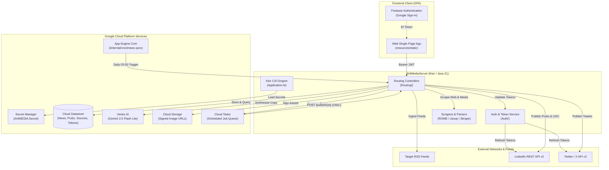

# AI4Media

**AI4Media** is an intelligent content aggregation, generative AI copywriting, and automated social media scheduling platform. Architected as a serverless microservice on **Google Cloud App Engine Standard** (Java 21 / Kotlin / Ktor), it orchestrates the entire social marketing lifecycle—from high-concurrency RSS feed ingestion and heuristic web scraping, to LLM-powered multi-persona copy generation with Google Cloud Vertex AI (Gemini), intelligent algorithmic scheduling, and distributed multi-platform publishing.

---

## 🏛️ System Architecture



---

## 🎯 What AI4Media Accomplishes

1. **Automated Content Aggregation & Curation**:
   - Ingests feeds across subscribed RSS sources concurrently with a pool of Kotlin coroutine workers.
   - Heuristically extracts clean article text, metadata, and high-resolution preview images (evaluating OpenGraph, Twitter Cards, JSON-LD, and DOM dimensions).
   - Deduplicates articles using SHA-256 URL keys and automatically prunes stale news based on retention limits.

2. **Generative AI Copywriting Pipeline**:
   - Transforms scraped articles into platform-optimized copy using **Google Cloud Vertex AI (Gemini 2.5 Flash Lite)**.
   - Enforces prompt-injection defenses and structured JSON schemas to generate:
     - **LinkedIn Company Page**: Professional industry observer summary.
     - **LinkedIn Personal Profile**: Analytical "thought leadership" bump / engagement prompt to spark discussions and reshare company posts.
     - **Twitter / X**: Punchy post adhering strictly to the 280-character limit.
     - Strategic SEO tags and reasoning.

3. **Smart Algorithmic Scheduling**:
   - Supports immediate (`NOW`), manual (`SCHEDULED`), and algorithmic (`AUTOMATIC`) scheduling.
   - In automatic mode, calculates optimal time slots within high-engagement daily windows ("Morning", "Lunch", "Commute", "Night") while enforcing user-configured daily publication quotas per social network.

4. **Distributed Asynchronous Task Dispatch**:
   - Enqueues delayed HTTP callbacks to Google Cloud Tasks with Google OpenID Connect (OIDC) service-account authentication targeting `/publish/{id}`.

5. **Multi-Platform Social Publishing & OAuth Lifecycle**:
   - Connects to **LinkedIn REST API v2** (UGC posts, digital media asset registration/upload, and first-comment link sharing).
   - Connects to **Twitter/X API v2** for tweet publishing.
   - Manages OAuth 2.0 PKCE authorization and transparently refreshes expiring access tokens with a 60-second safety window.

6. **Embedded Web Single-Page Application (SPA)**:
   - Built with Alpine.js 3.x, Tailwind CSS, Font Awesome, and Chart.js, embedded directly in the backend resources.
   - Features Firebase Google Sign-In, real-time bilingual localization (EN/ES), post composer, queue management, reading lists, and tag analytics.

---

## 📁 Repository Structure & Documentation Index

```text
AI4Media/
└── backend/
    └── AI4MediaServer/                 # Core Ktor backend server
        ├── build.gradle.kts            # Gradle build configuration & toolchain
        ├── settings.gradle.kts         # Gradle project settings
        ├── README.md                   # AI4MediaServer root documentation
        │
        ├── src/main/                   # Main application source root
        │   ├── README.md               # Source directory documentation
        │   ├── appengine/              # App Engine deployment descriptors
        │   │   ├── app.yaml            # Service descriptor, scaling & runtime
        │   │   ├── cron.yaml           # App Engine cron job schedules
        │   │   ├── dispatch.yaml       # Domain routing rules
        │   │   ├── index.yaml          # Datastore composite index definitions
        │   │   └── README.md           # App Engine deployment documentation
        │   │
        │   ├── kotlin/                 # Core Kotlin backend source code
        │   │   └── com/catharsis/ai4media/ai4mediaserver/
        │   │       ├── Application.kt  # Server bootstrap, plugins & auth configuration
        │   │       ├── CloudTasks.kt   # Cloud Tasks queue client
        │   │       ├── SocialContent.kt# Domain models & serializers
        │   │       ├── README.md       # Backend package documentation
        │   │       ├── Auth/           # OAuth 2.0 PKCE, Token persistence & OIDC
        │   │       ├── Config/         # AppConfig & Secret Manager client
        │   │       ├── Networks/       # LinkedIn & Twitter API v2 connectors
        │   │       ├── Routing/        # REST API controllers & scheduler logic
        │   │       └── Utils/          # Vertex AI, Datastore, GCS signer & scrapers
        │   │
        │   └── resources/              # Runtime configurations & static web assets
        │       ├── application.conf    # Ktor HOCON server configuration
        │       ├── logback.xml         # Logback console & GCP JSON logging profiles
        │       ├── README.md           # Resources directory documentation
        │       └── static/             # Client-side Single Page Application (SPA)
        │           ├── index.html      # HTML5 layout & Alpine.js templates
        │           ├── app.js          # Reactive state controller & API client
        │           ├── auth.js         # Firebase Auth integration
        │           ├── firebase-config.js # Firebase modular SDK initialization
        │           ├── styles.css      # Styling & dynamic background patterns
        │           └── README.md       # Frontend SPA documentation
        │
        └── test/                       # Automated test suites
            └── kotlin/com/example/
                ├── GoogleAppEngineTest.kt # Integration test suite for Ktor lifecycle
                └── README.md           # Test suite documentation
```

### Module Documentation Directory

| Component | Path | Documentation Link |
| :--- | :--- | :--- |
| **Backend Server** | `backend/AI4MediaServer` | [AI4MediaServer README](backend/AI4MediaServer/README.md) |
| **Main Source Root** | `backend/AI4MediaServer/src/main` | [Main Source README](backend/AI4MediaServer/src/main/README.md) |
| **App Engine Deployment** | `backend/AI4MediaServer/src/main/appengine` | [App Engine Deployment README](backend/AI4MediaServer/src/main/appengine/README.md) |
| **Backend Package** | `backend/AI4MediaServer/src/main/kotlin/.../ai4mediaserver` | [Backend Core README](backend/AI4MediaServer/src/main/kotlin/com/catharsis/ai4media/ai4mediaserver/README.md) |
| **Authentication & Tokens** | `backend/AI4MediaServer/src/main/kotlin/.../Auth` | [Auth Submodule README](backend/AI4MediaServer/src/main/kotlin/com/catharsis/ai4media/ai4mediaserver/Auth/README.md) |
| **Configuration & Secrets** | `backend/AI4MediaServer/src/main/kotlin/.../Config` | [Config Submodule README](backend/AI4MediaServer/src/main/kotlin/com/catharsis/ai4media/ai4mediaserver/Config/README.md) |
| **Social Media Connectors** | `backend/AI4MediaServer/src/main/kotlin/.../Networks` | [Networks Submodule README](backend/AI4MediaServer/src/main/kotlin/com/catharsis/ai4media/ai4mediaserver/Networks/README.md) |
| **HTTP Routing & APIs** | `backend/AI4MediaServer/src/main/kotlin/.../Routing` | [Routing Submodule README](backend/AI4MediaServer/src/main/kotlin/com/catharsis/ai4media/ai4mediaserver/Routing/README.md) |
| **Utilities & Integrations** | `backend/AI4MediaServer/src/main/kotlin/.../Utils` | [Utils Submodule README](backend/AI4MediaServer/src/main/kotlin/com/catharsis/ai4media/ai4mediaserver/Utils/README.md) |
| **Runtime Resources** | `backend/AI4MediaServer/src/main/resources` | [Resources README](backend/AI4MediaServer/src/main/resources/README.md) |
| **Frontend Web SPA** | `backend/AI4MediaServer/src/main/resources/static` | [Frontend SPA README](backend/AI4MediaServer/src/main/resources/static/README.md) |
| **Automated Tests** | `backend/AI4MediaServer/test/kotlin/com/example` | [Test Suite README](backend/AI4MediaServer/test/kotlin/com/example/README.md) |

---

## 🛠️ Technology Stack

| Layer | Technology | Details |
| :--- | :--- | :--- |
| **Language & Toolchain** | Kotlin `2.2.0` / Java `21` | Configured via Gradle Toolchain in [`build.gradle.kts`](backend/AI4MediaServer/build.gradle.kts) |
| **Backend Framework** | Ktor `3.4.1` (CIO Engine) | Non-blocking asynchronous web server and HTTP client |
| **Cloud Hosting** | Google App Engine Standard | Microservice `backend` running Java 21 runtime with automatic scaling |
| **Databases & Queues** | Cloud Datastore & Cloud Tasks | NoSQL entity persistence and asynchronous task distribution |
| **AI / Machine Learning** | Google Cloud Vertex AI | Gemini LLM (`gemini-2.5-flash-lite`) copy synthesis |
| **Security & Auth** | Firebase Auth & OAuth 2.0 PKCE | Firebase client authentication and RFC 7636 PKCE social authorization |
| **Secrets & Storage** | Secret Manager & Cloud Storage | Secure credential injection and V4 signed URL asset delivery |
| **Frontend Framework** | Alpine.js `3.x` & Tailwind CSS | Lightweight reactive UI embedded directly in server resources |
| **Build & Packaging** | Gradle & Shadow JAR `8.3.6` | Fat JAR compilation (`AI4MediaServer-all.jar`) and App Engine deployment |

---

## 🚀 Building & Running Locally

### Prerequisites
- **JDK 21** installed (`JavaLanguageVersion.of(21)`).
- **Google Cloud SDK (`gcloud`)** authenticated with application default credentials:
  ```bash
  gcloud auth application-default login
  ```

### Development Commands
```bash
cd backend/AI4MediaServer

# Run local development server (port 8080)
./gradlew run

# Execute test suite
./gradlew test

# Build executable Shadow Fat JAR
./gradlew shadowJar
```

### Deployment
```bash
# Automated deployment via Gradle
./gradlew appengineDeploy

# Manual component deployment via gcloud CLI
gcloud app deploy src/main/appengine/app.yaml
gcloud app deploy src/main/appengine/cron.yaml
gcloud app deploy src/main/appengine/dispatch.yaml
gcloud app deploy src/main/appengine/index.yaml
```
