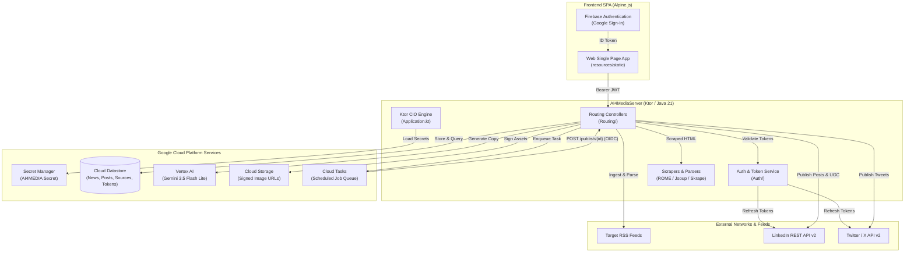

# AI4MediaServer

**AI4MediaServer** is an enterprise-grade content aggregation, generative AI copywriting, and automated social media scheduling platform. Built on Kotlin and the [Ktor](https://ktor.io/) asynchronous engine, it is architected for deployment as a microservice on **Google Cloud App Engine Standard** (Java 21).

The server orchestrates the complete social publishing lifecycle: aggregating RSS and web feeds, extracting metadata and media assets, synthesizing audience-targeted social posts via Google Cloud Vertex AI (Gemini), queueing distribution through Google Cloud Tasks, and publishing to LinkedIn and Twitter/X.

---

## 🏛️ System Architecture



---

## 📁 Repository & Subdirectory Structure

```text
AI4MediaServer/
├── build.gradle.kts             # Gradle build configuration & plugin definitions
├── settings.gradle.kts          # Gradle settings & plugin management
├── gradle.properties            # Dependency versions (Ktor, Kotlin, Logback)
├── gradlew                      # Gradle wrapper script (Unix/Linux)
├── .gitignore                   # Git ignore specifications
│
├── src/main/                    # Main application source root
│   ├── README.md                # Source directory documentation
│   ├── appengine/               # Google App Engine deployment manifests
│   │   ├── app.yaml             # Service descriptor, scaling & runtime specs
│   │   ├── cron.yaml            # Cron schedules (Daily RSS news sync)
│   │   ├── dispatch.yaml        # Domain routing rules (planner.catharsis.computer)
│   │   ├── index.yaml           # Cloud Datastore composite index definitions
│   │   └── README.md            # App Engine deployment documentation
│   │
│   ├── kotlin/                  # Core Kotlin backend source code
│   │   └── com/catharsis/ai4media/ai4mediaserver/
│   │       ├── Application.kt   # Server bootstrap, plugins & auth configuration
│   │       ├── CloudTasks.kt    # Google Cloud Tasks client wrapper
│   │       ├── SocialContent.kt # Domain models, status enums & serializers
│   │       ├── README.md        # Core backend package overview
│   │       ├── Auth/            # OAuth 2.0 PKCE, Token persistence & OIDC verification
│   │       ├── Config/          # Centralized configuration & Secret Manager client
│   │       ├── Networks/        # LinkedIn v2 & Twitter/X v2 social connectors
│   │       ├── Routing/         # REST API endpoints & scheduling algorithms
│   │       └── Utils/           # Vertex AI, Datastore repos, GCS signer & scrapers
│   │
│   └── resources/               # Runtime configurations & static web assets
│       ├── application.conf     # Ktor HOCON server configuration
│       ├── logback.xml          # Logback console & GCP JSON logging profiles
│       ├── README.md            # Resources directory documentation
│       └── static/              # Embedded client-side Single Page Application (SPA)
│           ├── index.html       # HTML5 layout & Alpine.js templates
│           ├── app.js           # Reactive Alpine.js state controller & API client
│           ├── auth.js          # Firebase Authentication client
│           ├── firebase-config.js # Firebase modular SDK initialization
│           ├── styles.css       # Custom styles & background patterns
│           └── README.md        # Frontend Single Page Application documentation
│
└── test/                        # Automated test suites
    └── kotlin/com/example/
        ├── GoogleAppEngineTest.kt # Integration test suite for Ktor lifecycle & endpoints
        └── README.md            # Test suite documentation
```

---

## 🗂️ Submodule Documentation Index

Detailed architectural documentation, file inventories, and API references are available across all submodules:

| Submodule / Directory | Path | Documentation Link |
| :--- | :--- | :--- |
| **Main Source Root** | `src/main` | [Main Source Directory README](file:///home/almo/Engineering/Machine-Learning/AI4Media/backend/AI4MediaServer/src/main/README.md) |
| **App Engine Deployment** | `src/main/appengine` | [App Engine README](file:///home/almo/Engineering/Machine-Learning/AI4Media/backend/AI4MediaServer/src/main/appengine/README.md) |
| **Backend Core Package** | `src/main/kotlin/.../ai4mediaserver` | [Backend Package README](file:///home/almo/Engineering/Machine-Learning/AI4Media/backend/AI4MediaServer/src/main/kotlin/com/catharsis/ai4media/ai4mediaserver/README.md) |
| **Auth & Token Lifecycle** | `src/main/kotlin/.../Auth` | [Auth Submodule README](file:///home/almo/Engineering/Machine-Learning/AI4Media/backend/AI4MediaServer/src/main/kotlin/com/catharsis/ai4media/ai4mediaserver/Auth/README.md) |
| **Configuration & Secrets** | `src/main/kotlin/.../Config` | [Config Submodule README](file:///home/almo/Engineering/Machine-Learning/AI4Media/backend/AI4MediaServer/src/main/kotlin/com/catharsis/ai4media/ai4mediaserver/Config/README.md) |
| **Social Media Connectors** | `src/main/kotlin/.../Networks` | [Networks Submodule README](file:///home/almo/Engineering/Machine-Learning/AI4Media/backend/AI4MediaServer/src/main/kotlin/com/catharsis/ai4media/ai4mediaserver/Networks/README.md) |
| **HTTP Routing & REST APIs** | `src/main/kotlin/.../Routing` | [Routing Submodule README](file:///home/almo/Engineering/Machine-Learning/AI4Media/backend/AI4MediaServer/src/main/kotlin/com/catharsis/ai4media/ai4mediaserver/Routing/README.md) |
| **Utilities & Integrations** | `src/main/kotlin/.../Utils` | [Utils Submodule README](file:///home/almo/Engineering/Machine-Learning/AI4Media/backend/AI4MediaServer/src/main/kotlin/com/catharsis/ai4media/ai4mediaserver/Utils/README.md) |
| **Server Resources** | `src/main/resources` | [Resources README](file:///home/almo/Engineering/Machine-Learning/AI4Media/backend/AI4MediaServer/src/main/resources/README.md) |
| **Client-Side Web SPA** | `src/main/resources/static` | [Frontend SPA README](file:///home/almo/Engineering/Machine-Learning/AI4Media/backend/AI4MediaServer/src/main/resources/static/README.md) |
| **Automated Test Suite** | `test/kotlin/com/example` | [Test Suite README](file:///home/almo/Engineering/Machine-Learning/AI4Media/backend/AI4MediaServer/test/kotlin/com/example/README.md) |

---

## ⚡ Core Capabilities & Subsystems

### 1. Ingestion & Content Scraping Pipeline
- **RSS Aggregation**: High-concurrency feed ingestion powered by Kotlin Coroutines, ROME tools (`SyndFeedInput`), and worker channels in [`NewsRoutes.kt`](file:///home/almo/Engineering/Machine-Learning/AI4Media/backend/AI4MediaServer/src/main/kotlin/com/catharsis/ai4media/ai4mediaserver/Routing/NewsRoutes.kt).
- **Heuristic Media Resolution**: Multi-tier OpenGraph, Twitter Cards, JSON-LD, and DOM image parsing in [`WebScrapper.kt`](file:///home/almo/Engineering/Machine-Learning/AI4Media/backend/AI4MediaServer/src/main/kotlin/com/catharsis/ai4media/ai4mediaserver/Utils/WebScrapper.kt) and [`NewsScrapper.kt`](file:///home/almo/Engineering/Machine-Learning/AI4Media/backend/AI4MediaServer/src/main/kotlin/com/catharsis/ai4media/ai4mediaserver/Utils/NewsScrapper.kt).
- **Automated Lifecycle**: Scheduled daily news ingestion triggered via App Engine Cron ([`cron.yaml`](file:///home/almo/Engineering/Machine-Learning/AI4Media/backend/AI4MediaServer/src/main/appengine/cron.yaml)) and automated data purging governed by retention policies.

### 2. Generative AI Copywriting Engine
- **Vertex AI Gemini Client**: Interfaces with `gemini-2.5-flash` (configurable via `VERTEX_AI_MODEL`) in [`VertexAI.kt`](file:///home/almo/Engineering/Machine-Learning/AI4Media/backend/AI4MediaServer/src/main/kotlin/com/catharsis/ai4media/ai4mediaserver/Utils/VertexAI.kt).
- **Persona-Tailored Copy**: Generates formatted posts for LinkedIn Organization accounts, LinkedIn Personal thought-leadership bump posts, and concise Twitter/X tweets in [`AiGenerateRoutes.kt`](file:///home/almo/Engineering/Machine-Learning/AI4Media/backend/AI4MediaServer/src/main/kotlin/com/catharsis/ai4media/ai4mediaserver/Routing/AiGenerateRoutes.kt).
- **Prompt Injection Defense & Cost Tracking**: Strict JSON schema responses and token/cost tracking metrics recorded per request.

### 3. Smart Scheduling & Cloud Tasks Dispatch
- **Algorithmic Distribution**: Intelligently assigns posts to engagement "sweet spots" (Morning, Lunch, Commute, Night) while enforcing daily quota limits in [`Routing.kt`](file:///home/almo/Engineering/Machine-Learning/AI4Media/backend/AI4MediaServer/src/main/kotlin/com/catharsis/ai4media/ai4mediaserver/Routing/Routing.kt).
- **Google Cloud Tasks Queue**: Asynchronously schedules HTTP callback tasks with OIDC service-account authorization via [`CloudTasks.kt`](file:///home/almo/Engineering/Machine-Learning/AI4Media/backend/AI4MediaServer/src/main/kotlin/com/catharsis/ai4media/ai4mediaserver/CloudTasks.kt).

### 4. Social Network Publishing Connectors
- **LinkedIn v2 Connector**: Publishes UGC posts to organization timelines, registers and uploads digital media assets, and creates first-comment links in [`LinkedinConnector.kt`](file:///home/almo/Engineering/Machine-Learning/AI4Media/backend/AI4MediaServer/src/main/kotlin/com/catharsis/ai4media/ai4mediaserver/Networks/LinkedinConnector.kt).
- **Twitter/X v2 Connector**: Dispatches formatted tweets via Twitter API v2 in [`TwitterConnector.kt`](file:///home/almo/Engineering/Machine-Learning/AI4Media/backend/AI4MediaServer/src/main/kotlin/com/catharsis/ai4media/ai4mediaserver/Networks/TwitterConnector.kt).
- **Preemptive Token Refresh**: Transparently checks OAuth expiration and automatically refreshes tokens in [`TokenService.kt`](file:///home/almo/Engineering/Machine-Learning/AI4Media/backend/AI4MediaServer/src/main/kotlin/com/catharsis/ai4media/ai4mediaserver/Auth/TokenService.kt).

### 5. Embedded Single Page Application (SPA)
- **Modern UI**: Lightweight reactive dashboard built with Alpine.js, Tailwind CSS, Font Awesome, and Chart.js in [`src/main/resources/static`](file:///home/almo/Engineering/Machine-Learning/AI4Media/backend/AI4MediaServer/src/main/resources/static/README.md).
- **Bilingual & Modular**: Real-time localization (EN/ES), Firebase Google login, post queue manager, reading list, and analytics radar charts.

---

## 🛠️ Technology Stack

| Layer | Technology | Description |
| :--- | :--- | :--- |
| **Language & Runtime** | Kotlin `2.2.0` / Java `21` | Configured via Gradle Toolchain in [`build.gradle.kts`](file:///home/almo/Engineering/Machine-Learning/AI4Media/backend/AI4MediaServer/build.gradle.kts) |
| **Backend Framework** | Ktor `3.4.1` (CIO Engine) | Non-blocking asynchronous web server and HTTP client |
| **Cloud Hosting** | Google App Engine Standard | Microservice `backend` running Java 21 runtime with automatic scaling |
| **Databases & Queues** | Cloud Datastore & Cloud Tasks | NoSQL entity persistence and asynchronous task distribution |
| **AI / Machine Learning** | Google Cloud Vertex AI | Gemini LLM (`gemini-2.5-flash`) copy synthesis |
| **Security & Auth** | Firebase Auth & OAuth 2.0 PKCE | Firebase client authentication and RFC 7636 PKCE social authorization |
| **Secrets & Storage** | Secret Manager & Cloud Storage | Secure credential injection and V4 signed URL asset delivery |
| **Frontend Framework** | Alpine.js `3.x` & Tailwind CSS | Lightweight reactive UI embedded directly in server resources |
| **Build & Packaging** | Gradle & Shadow JAR `8.3.6` | Fat JAR compilation (`AI4MediaServer-all.jar`) and App Engine deployment |

---

## 🔧 Configuration & Environment

The application dynamically combines system environment variables with Google Cloud Secret Manager payloads:

### Environment Variables
| Variable | Description | Default / Example |
| :--- | :--- | :--- |
| `GOOGLE_CLOUD_PROJECT` | GCP Project ID | `meta-gear-464720-g3` |
| `APPENGINE_BASE_URL` | Public Base URL for OAuth redirects | `https://planner.catharsis.computer` |
| `RSS_NEWS_BASELINE_CUTOFF_DAYS` | RSS initial synchronization window | `45` |
| `RSS_NEWS_RETENTION_DAYS` | RSS news retention limit | `30` |

### Google Cloud Secret Manager (`AI4MEDIA` Secret JSON)
Loaded securely at runtime by [`SecretManager.kt`](file:///home/almo/Engineering/Machine-Learning/AI4Media/backend/AI4MediaServer/src/main/kotlin/com/catharsis/ai4media/ai4mediaserver/Config/SecretManager.kt):
- `CLOUD_LOCATION_ID`: GCP Region (e.g. `us-central1`).
- `CLOUD_TASKS_QUEUE_ID`: Target Cloud Tasks queue identifier.
- `GOOGLE_CLOUD_SERVICE_ACCOUNT`: Service Account email for OIDC identity.
- `TWITTER_CLIENT_ID` & `TWITTER_CLIENT_SECRET`: Twitter OAuth 2.0 credentials.
- `LINKEDIN_CLIENT_ID` & `LINKEDIN_CLIENT_SECRET`: LinkedIn OAuth 2.0 credentials.
- `OAUTH_SESSION_SECRET_KEY`: HMAC-SHA256 session signing key.
- `SECRET_ENCRYPT_KEY`: AES-128/256 session encryption key.

---

## 🚀 Building & Running Locally

### Prerequisites
- **JDK 21** installed (`JavaLanguageVersion.of(21)`).
- **Google Cloud SDK (`gcloud`)** authenticated with application default credentials (`gcloud auth application-default login`).

### Running the Development Server
```bash
./gradlew run
```
The server will start on port `8080` (accessible at `http://localhost:8080`).

### Running Tests
Execute the automated test suite using the Gradle wrapper:
```bash
./gradlew test
```

### Packaging Shadow Fat JAR
Create the executable deployment fat JAR:
```bash
./gradlew shadowJar
```
The generated JAR is output to `build/libs/AI4MediaServer-all.jar`.

---

## ☁️ Deployment

### Automated App Engine Deployment (Gradle)
```bash
./gradlew appengineDeploy
```

### Manual Deployment (Google Cloud CLI)
Deploy application components independently using `gcloud`:
```bash
# 1. Deploy the backend service
gcloud app deploy src/main/appengine/app.yaml

# 2. Deploy the cron job schedules
gcloud app deploy src/main/appengine/cron.yaml

# 3. Deploy traffic dispatch routing rules
gcloud app deploy src/main/appengine/dispatch.yaml

# 4. Deploy Datastore composite indexes
gcloud app deploy src/main/appengine/index.yaml
```
