# Comprehensive Technical Review & Architectural Gap Analysis: AI4MediaServer

**Document Version:** 1.1.0  
**Date:** 2026-08-14  
**Target System:** AI4MediaServer (Ktor / Java 21 / Google App Engine Standard)  
**Tracking Repository:** [`almo/Machine-Learning`](https://github.com/almo/Machine-Learning)

---

## Executive Summary

This document captures a comprehensive architectural and code-level technical review of the **AI4MediaServer** codebase and its design documentation ([`README.md`](file:///home/almo/Engineering/Machine-Learning/AI4Media/backend/AI4MediaServer/README.md)). The audit examined all Kotlin source files, configuration manifests, build scripts, frontend templates, and deployment descriptors to uncover latent bugs, security vulnerabilities, concurrency hazards, multi-tenancy flaws, resource leaks, and missing edge cases.

All findings have been logged as active issues in GitHub for incremental implementation and verification.

---

## 📌 Master Issue Tracking Matrix

| Issue ID | Priority | Category | Title & Link | Target Component | Status |
| :--- | :--- | :--- | :--- | :--- | :--- |
| **[#32](https://github.com/almo/Machine-Learning/issues/32)** | `P0 - Critical` | Bug | [[BUG] Prevent Ghost Publishing of Deleted Posts in Cloud Tasks](https://github.com/almo/Machine-Learning/issues/32) | `Routing.kt`, `CloudTasks.kt` | Open |
| **[#33](https://github.com/almo/Machine-Learning/issues/33)** | `P0 - Critical` | Bug | [[BUG] Fix Multi-Tenant Key Collision in RSS Ingestion Datastore Entities](https://github.com/almo/Machine-Learning/issues/33) | `NewsRoutes.kt` | **Resolved** |
| **[#34](https://github.com/almo/Machine-Learning/issues/34)** | `P1 - High` | Feature | [[FEATURE] Implement Dynamic Multi-User LinkedIn URNs & Personal Reshare Bump Pipeline](https://github.com/almo/Machine-Learning/issues/34) | `LinkedinConnector.kt`, `Routing.kt` | Open |
| **[#35](https://github.com/almo/Machine-Learning/issues/35)** | `P1 - High` | Security | [[SECURITY] Enforce Subject and Email Verification on Google Cloud Tasks OIDC Tokens](https://github.com/almo/Machine-Learning/issues/35) | `TokenVerifier.kt` | Open |
| **[#36](https://github.com/almo/Machine-Learning/issues/36)** | `P1 - High` | Security | [[SECURITY] Prevent IDOR on \`/publish/{id}\` for Firebase-Authenticated Users](https://github.com/almo/Machine-Learning/issues/36) | `Routing.kt` | Open |
| **[#37](https://github.com/almo/Machine-Learning/issues/37)** | `P0 - Critical` | Bug | [[BUG] Fix OAuth Callback 404 Redirect & Session Expiration Window](https://github.com/almo/Machine-Learning/issues/37) | `AuthRoutes.kt`, `Application.kt` | **Resolved** |
| **[#38](https://github.com/almo/Machine-Learning/issues/38)** | `P2 - Medium` | Reliability | [[RELIABILITY] Persist User Scheduling Settings in Cloud Datastore](https://github.com/almo/Machine-Learning/issues/38) | `Routing.kt`, `DataStore.kt` | Open |
| **[#39](https://github.com/almo/Machine-Learning/issues/39)** | `P0 - Critical` | Concurrency | [[BUG] Add Atomic Datastore State Transitions & Idempotency to \`/publish/{id}\`](https://github.com/almo/Machine-Learning/issues/39) | `Routing.kt`, `DataStore.kt` | Open |
| **[#40](https://github.com/almo/Machine-Learning/issues/40)** | `P1 - High` | Bug | [[BUG] Fix Twitter 280-Character Boundary Overflow & Weighting Calculation](https://github.com/almo/Machine-Learning/issues/40) | `TwitterConnector.kt` | Open |
| **[#41](https://github.com/almo/Machine-Learning/issues/41)** | `P1 - High` | Performance | [[PERFORMANCE] Refactor CloudTasksClient to Singleton and Fix App Engine Coroutine Lifecycles](https://github.com/almo/Machine-Learning/issues/41) | `CloudTasks.kt`, `NewsRoutes.kt` | Open |
| **[#42](https://github.com/almo/Machine-Learning/issues/42)** | `P1 - High` | Security | [[SECURITY] Sanitize XML Boundary Delimiters, Add SSRF Guard & Adopt Structured Outputs](https://github.com/almo/Machine-Learning/issues/42) | `AiGenerateRoutes.kt` | Open |
| **[#43](https://github.com/almo/Machine-Learning/issues/43)** | `P1 - High` | Bug | [[BUG] Fix Cloud Storage Signed URL Generation on App Engine Standard](https://github.com/almo/Machine-Learning/issues/43) | `CloudStorage.kt`, `NewsRoutes.kt` | Open |
| **[#44](https://github.com/almo/Machine-Learning/issues/44)** | `P2 - Medium` | Cleanup | [[CLEANUP] Integrate or Prune Dead Scraper Subsystems (\`NewsScraper\` & \`ImageResolver\`)](https://github.com/almo/Machine-Learning/issues/44) | `NewsScrapper.kt`, `WebScrapper.kt` | Open |
| **[#45](https://github.com/almo/Machine-Learning/issues/45)** | `P2 - Medium` | Testing | [[TESTING] Modernize Automated Integration & Unit Test Suite](https://github.com/almo/Machine-Learning/issues/45) | `test/` | Open |
| **[#46](https://github.com/almo/Machine-Learning/issues/46)** | `P0 - Critical` | Bug | [[AI4MediaServer] Fix orphan Kotlin files missing package declarations](https://github.com/almo/Machine-Learning/issues/46) | `CloudStorage.kt`, `WebScrapper.kt` | **Resolved** |
| **[#47](https://github.com/almo/Machine-Learning/issues/47)** | `P0 - Critical` | Infrastructure | [[INFRASTRUCTURE] Upgrade App Engine Instance Class to F2 and Configure JVM Memory Flags](https://github.com/almo/Machine-Learning/issues/47) | `app.yaml` | Open |
| **[#48](https://github.com/almo/Machine-Learning/issues/48)** | `P0 - Critical` | Security | [[SECURITY] Encrypt OAuth Access and Refresh Tokens at Rest in Cloud Datastore](https://github.com/almo/Machine-Learning/issues/48) | `TokenService.kt` | Open |
| **[#49](https://github.com/almo/Machine-Learning/issues/49)** | `P0 - Critical` | AI / Bug | [[BUG] Fix Invalid Vertex AI Model Identifier and High Generation Temperature](https://github.com/almo/Machine-Learning/issues/49) | `VertexAI.kt` | **Resolved** |
| **[#50](https://github.com/almo/Machine-Learning/issues/50)** | `P1 - High` | Concurrency | [[CONCURRENCY] Prevent Twitter OAuth Refresh Token Rotation Stampede and Grant Revocation](https://github.com/almo/Machine-Learning/issues/50) | `TokenService.kt` | Open |
| **[#51](https://github.com/almo/Machine-Learning/issues/51)** | `P2 - Medium` | Performance | [[PERFORMANCE] Fix Unbounded HttpClient Instantiation Leak in Ktor OAuth ProviderLookup](https://github.com/almo/Machine-Learning/issues/51) | `Application.kt` | **Resolved** |
| **[#52](https://github.com/almo/Machine-Learning/issues/52)** | `P2 - Medium` | Logging | [[LOGGING] Resolve Conflicting Duplicate Root Elements in Logback Configuration](https://github.com/almo/Machine-Learning/issues/52) | `logback.xml` | **Resolved** |

---

## 1. 🚨 Critical Bugs & Architectural Flaws

### 1.1. Multi-Tenant RSS Feed Data Collision & Overwrite
* **GitHub Issue:** [#33](https://github.com/almo/Machine-Learning/issues/33)
* **Source Location:** [`NewsRoutes.kt:432-440`](file:///home/almo/Engineering/Machine-Learning/AI4Media/backend/AI4MediaServer/src/main/kotlin/com/catharsis/ai4media/ai4mediaserver/Routing/NewsRoutes.kt#L432-L440)
* **The Flaw:** When saving news articles into Google Cloud Datastore (`RSSNews` kind), the entity key is generated solely from the SHA-256 hash of the article URL:
  ```kotlin
  val urlHash = article.url.toSha256()
  val key = datastore.newKeyFactory().setKind("RSSNews").newKey(urlHash)
  val entityBuilder = Entity.newBuilder(key)
      .set("sourceId", sourceId)
      .set("userId", userId)
      // ...
  ```
* **Failure Scenario & Impact:** If multiple users subscribe to the same RSS feed (e.g., *TechCrunch* or *Hacker News*), User B's sync overwrites the Datastore entity previously created for User A. User A's `userId` ownership is replaced, and if User A marked the news item as `read = true`, it is reset to `read = false` for User B. User A silently loses their read state and article history.
* **Remediation:** Scope the Datastore key by both `userId` and `urlHash`:
  ```kotlin
  val scopedKeyName = "${userId}_${article.url.toSha256()}"
  val key = datastore.newKeyFactory().setKind("RSSNews").newKey(scopedKeyName)
  ```

---

### 1.2. Deleted Posts Are Still Published by Google Cloud Tasks
* **GitHub Issue:** [#32](https://github.com/almo/Machine-Learning/issues/32)
* **Source Location:** [`ScheduledContentRoutes.kt:194-197`](file:///home/almo/Engineering/Machine-Learning/AI4Media/backend/AI4MediaServer/src/main/kotlin/com/catharsis/ai4media/ai4mediaserver/Routing/ScheduledContentRoutes.kt#L194-L197) & [`Routing.kt:261-265`](file:///home/almo/Engineering/Machine-Learning/AI4Media/backend/AI4MediaServer/src/main/kotlin/com/catharsis/ai4media/ai4mediaserver/Routing/Routing.kt#L261-L265)
* **The Flaw:** When a user soft-deletes a scheduled post via `DELETE /api/scheduled/{id}`, the backend updates the entity's status to `PostStatus.DELETED`. However, the corresponding HTTP Cloud Task previously scheduled in [`CloudTasks.kt`](file:///home/almo/Engineering/Machine-Learning/AI4Media/backend/AI4MediaServer/src/main/kotlin/com/catharsis/ai4media/ai4mediaserver/CloudTasks.kt) is not cancelled. When Cloud Tasks later invokes `POST /publish/{id}`, the endpoint only checks:
  ```kotlin
  if (entity.contains("status") && entity.getString("status") == PostStatus.PUBLISHED.name) {
      call.application.log.info("Post already published (ID: $postId)")
      call.respond(HttpStatusCode.OK)
      return@post
  }
  ```
* **Failure Scenario & Impact:** Because `POST /publish/{id}` does not verify that `status != DELETED`, **any post deleted by a user in the UI will still be published to LinkedIn or Twitter when its scheduled execution time arrives.**
* **Remediation:** In [`Routing.kt:261`](file:///home/almo/Engineering/Machine-Learning/AI4Media/backend/AI4MediaServer/src/main/kotlin/com/catharsis/ai4media/ai4mediaserver/Routing/Routing.kt#L261), guard the execution so only valid scheduled states (`SCHEDULED` or `AUTOSCHEDULED`) proceed:
  ```kotlin
  val currentStatus = if (entity.contains("status")) entity.getString("status") else ""
  if (currentStatus != PostStatus.SCHEDULED.name && currentStatus != PostStatus.AUTOSCHEDULED.name) {
      call.application.log.warn("Post $postId is in status '$currentStatus'; skipping publication.")
      call.respond(HttpStatusCode.OK, "Post is not in scheduled state")
      return@post
  }
  ```

---

### 1.3. Double-Publishing Race Condition on Cloud Tasks Retries
* **GitHub Issue:** [#39](https://github.com/almo/Machine-Learning/issues/39)
* **Source Location:** [`Routing.kt:250-318`](file:///home/almo/Engineering/Machine-Learning/AI4Media/backend/AI4MediaServer/src/main/kotlin/com/catharsis/ai4media/ai4mediaserver/Routing/Routing.kt#L250-L318)
* **The Flaw:** Google Cloud Tasks enforces *at-least-once* execution semantics. Under transient network slowdowns or timeouts, Cloud Tasks can deliver duplicate HTTP POST requests to `/publish/{id}` simultaneously. The handler performs an uncoordinated read, executes the social publishing API calls (LinkedIn/Twitter), and only then commits `PostStatus.PUBLISHED`.
* **Failure Scenario & Impact:** Both concurrent requests see `status == SCHEDULED`, both execute the social connector API calls, resulting in duplicate public posts on the user's social profiles.
* **Remediation:** Implement a Datastore transaction with state-checking lock (`SCHEDULED` &rarr; `PUBLISHING` transition) before triggering the external API call:
  ```kotlin
  val canPublish = DataStoreWrapper.transitionStatusIf(postId, expected = PostStatus.SCHEDULED, next = PostStatus.PUBLISHING)
  if (!canPublish) {
      call.respond(HttpStatusCode.OK, "Post already handled or in-flight")
      return@post
  }
  ```

---

### 1.4. Hardcoded Single-User Social URNs
* **GitHub Issue:** [#34](https://github.com/almo/Machine-Learning/issues/34)
* **Source Location:** [`LinkedinConnector.kt:23-24, 161`](file:///home/almo/Engineering/Machine-Learning/AI4Media/backend/AI4MediaServer/src/main/kotlin/com/catharsis/ai4media/ai4mediaserver/Networks/LinkedinConnector.kt#L23-L24)
* **The Flaw:** The singleton connector declares static hardcoded URNs for a single user/company:
  ```kotlin
  private const val ORGANIZATION_URN = "urn:li:organization:77043213"
  private const val USER_URN = "urn:li:person:RtKv3HcbdP"
  ```
  Furthermore, in `shareToUserTimeline`, the method fetches the authenticated user's `sub` identifier (`personId`) from LinkedIn's `/v2/userinfo` endpoint, but then ignores `personId` and publishes with `authorUrn = USER_URN` (defaulting to the hardcoded author).
* **Failure Scenario & Impact:** The application cannot function as a multi-tenant platform. Any other user will either post under the developer's identity or experience HTTP 403 Forbidden errors because their OAuth token lacks permission for the hardcoded organization URN.
* **Remediation:** Pass the target organization/author URN dynamically from the user's persisted settings or query the user's authorized organizations upon OAuth callback.

---

### 1.5. Frontend OAuth Redirect 404
* **GitHub Issue:** [#37](https://github.com/almo/Machine-Learning/issues/37)
* **Source Location:** [`AuthRoutes.kt:61, 77`](file:///home/almo/Engineering/Machine-Learning/AI4Media/backend/AI4MediaServer/src/main/kotlin/com/catharsis/ai4media/ai4mediaserver/Routing/AuthRoutes.kt#L61)
* **The Flaw:** Upon completing Twitter or LinkedIn OAuth authentication, the server executes:
  ```kotlin
  call.respondRedirect("/dashboard.html?success=true")
  ```
* **Failure Scenario & Impact:** There is no `dashboard.html` in [`src/main/resources/static/`](file:///home/almo/Engineering/Machine-Learning/AI4Media/backend/AI4MediaServer/src/main/resources/static/). The single-page application is hosted at `/` or `/index.html`. Users encounter a `404 Not Found` error immediately after completing social login.
* **Remediation:** Change redirects to `call.respondRedirect("/?auth=success")` or `call.respondRedirect("/index.html?auth=success")`.

---

## 2. 🛡️ Security Vulnerabilities & Misconfigurations

| Vulnerability | GitHub Issue | File / Location | Description & Risk | Suggested Fix |
| :--- | :--- | :--- | :--- | :--- |
| **Plaintext Token Storage in Datastore** | **[#48](https://github.com/almo/Machine-Learning/issues/48)** | [`TokenService.kt:81-89`](file:///home/almo/Engineering/Machine-Learning/AI4Media/backend/AI4MediaServer/src/main/kotlin/com/catharsis/ai4media/ai4mediaserver/Auth/TokenService.kt#L81-L89) | Access and Refresh tokens for Twitter and LinkedIn are saved as plaintext strings in Datastore (`UserTokens` kind). A Datastore export or read leak exposes full write access to all connected social accounts. | Encrypt token strings with AES-GCM using `AppConfig.sessionEncryptKey` before persisting. |
| **Weak OIDC Token Verification** | **[#35](https://github.com/almo/Machine-Learning/issues/35)** | [`TokenVerifier.kt:29-36`](file:///home/almo/Engineering/Machine-Learning/AI4Media/backend/AI4MediaServer/src/main/kotlin/com/catharsis/ai4media/ai4mediaserver/Auth/TokenVerifier.kt#L29-L36) | `TokenVerifier.verify()` validates the token signature and audience, but fails to check that `idToken.payload.email == AppConfig.serviceAccount` and `emailVerified == true`. Any Google account with a valid OIDC token targeting the audience can invoke `/publish/{id}`. | Enforce email verification in `TokenVerifier.verify()` against `AppConfig.serviceAccount`. |
| **IDOR on Post Publishing** | **[#36](https://github.com/almo/Machine-Learning/issues/36)** | [`Routing.kt:239-260`](file:///home/almo/Engineering/Machine-Learning/AI4Media/backend/AI4MediaServer/src/main/kotlin/com/catharsis/ai4media/ai4mediaserver/Routing/Routing.kt#L239-L260) | When invoked with Firebase auth, `/publish/{id}` did not verify that the authenticated `user.userId` owns the target `SocialContent` entity. | Enforce `entity.getString("userId") == user.userId` for Firebase principals. |
| **Server-Side Request Forgery (SSRF)** | **[#42](https://github.com/almo/Machine-Learning/issues/42)** | [`AiGenerateRoutes.kt:94-99`](file:///home/almo/Engineering/Machine-Learning/AI4Media/backend/AI4MediaServer/src/main/kotlin/com/catharsis/ai4media/ai4mediaserver/Routing/AiGenerateRoutes.kt#L94-L99) | `Jsoup.connect(targetUrl)` directly makes HTTP requests to arbitrary user-provided URLs without validating against private IP ranges (`127.0.0.1`, `169.254.169.254` GCP metadata, or RFC-1918 subnets). | Validate target host IP against a blocklist before establishing outbound connections. |
| **Broken Compression BREACH Filter** | - | [`Application.kt:77-80`](file:///home/almo/Engineering/Machine-Learning/AI4Media/backend/AI4MediaServer/src/main/kotlin/com/catharsis/ai4media/ai4mediaserver/Application.kt#L77-L80) | Compression condition requires `request.headers[Referrer]?.startsWith("https://planner.catharsis.computer/")`. Direct URL visits, bookmark clicks, and local dev (`localhost`) have `null` Referer, disabling compression globally. | Remove the rigid Referer prefix check or gate compression by content type and absence of sensitive session cookies. |

---

## 3. ⚙️ Infrastructure & Runtime Edge Cases (App Engine & JVM)

### 3.1. Out-of-Memory (OOM) on App Engine F1 Instance Class
* **GitHub Issue:** [#47](https://github.com/almo/Machine-Learning/issues/47)
* **Location:** [`app.yaml:2`](file:///home/almo/Engineering/Machine-Learning/AI4Media/backend/AI4MediaServer/src/main/appengine/app.yaml#L2)
* **Analysis:** `instance_class: F1` allocates only **256 MB RAM**. The application packages a fat JAR running:
  - Java 21 OpenJDK runtime
  - Ktor CIO asynchronous engine
  - Google Cloud SDKs: Vertex AI (gRPC), Secret Manager (gRPC), Cloud Datastore (gRPC/HTTP), Cloud Tasks (gRPC), Firebase Admin SDK
  - ROME XML feed parsers, Skrape{it}, and Jsoup DOM trees
* **Consequence:** During daily cron execution (`syncNewsForAllSources`) or Vertex AI generation, memory spikes will cause GC thrashing and container crash (`OOMKilled` / Exit Code 137).
* **Fix:** Upgrade `instance_class` to `F2` (512 MB) or `F4` (1024 MB), and configure JVM heap flags in `entrypoint`:
  ```yaml
  instance_class: F2
  entrypoint: 'java -XX:MaxRAMPercentage=75.0 -XX:+UseG1GC -jar AI4MediaServer-all.jar'
  ```

### 3.2. Coroutine Termination on App Engine Scaling
* **GitHub Issue:** [#41](https://github.com/almo/Machine-Learning/issues/41)
* **Location:** [`NewsRoutes.kt:56, 142`](file:///home/almo/Engineering/Machine-Learning/AI4Media/backend/AI4MediaServer/src/main/kotlin/com/catharsis/ai4media/ai4mediaserver/Routing/NewsRoutes.kt#L56) & [`Routing.kt:180`](file:///home/almo/Engineering/Machine-Learning/AI4Media/backend/AI4MediaServer/src/main/kotlin/com/catharsis/ai4media/ai4mediaserver/Routing/Routing.kt#L180)
* **Analysis:** Endpoints return `HttpStatusCode.Accepted` (202) while launching background tasks on unmanaged coroutine scopes (`publishingScope = CoroutineScope(Dispatchers.IO + SupervisorJob())`). In Google App Engine Standard, instance CPU is throttled or instances are terminated immediately once active HTTP request lifecycles complete.
* **Consequence:** Background RSS news syncing and immediate post publishing will be randomly terminated mid-flight.
* **Fix:** Keep cron job request handlers synchronous until workers complete within App Engine's 10-minute cron request timeout window.

### 3.3. Duplicate Logback Root Elements
* **GitHub Issue:** [#52](https://github.com/almo/Machine-Learning/issues/52)
* **Location:** [`logback.xml:16-21`](file:///home/almo/Engineering/Machine-Learning/AI4Media/backend/AI4MediaServer/src/main/resources/logback.xml#L16-L21)
* **Analysis:** `logback.xml` specifies two `<root>` elements (`level="trace"` with `STDOUT` and `level="INFO"` with `GCP_JSON_CONSOLE`).
* **Consequence:** Logback emits configuration warnings, the second `<root>` overrides the first, or duplicate logging entries (plain text + JSON) are pushed to Cloud Logging.
* **Fix:** Consolidate into a single `<root level="INFO">` tag.

---

## 4. 🔄 Resource Leaks & Concurrency Hazards

### 4.1. Unclosed gRPC and HTTP Clients
* **GitHub Issues:** [#41](https://github.com/almo/Machine-Learning/issues/41), [#51](https://github.com/almo/Machine-Learning/issues/51)
* **`CloudTasks.kt:33`**: `CloudTasksClient.create()` is instantiated on every task creation without `.close()` or `.use { }`, leaking gRPC channels and background thread pools.
* **`Application.kt:192, 220`**: `HttpClient(CIO)` is created inside the `providerLookup` closure of Ktor OAuth, instantiating a new HTTP engine on every OAuth challenge without closing existing ones.
* **Fix:** Convert `CloudTasksClient` and OAuth `HttpClient` instances into singletons or managed application lifecycle components.

### 4.2. Twitter Refresh Token Rotation Race Condition
* **GitHub Issue:** [#50](https://github.com/almo/Machine-Learning/issues/50)
* **Location:** [`TokenService.kt:147-193`](file:///home/almo/Engineering/Machine-Learning/AI4Media/backend/AI4MediaServer/src/main/kotlin/com/catharsis/ai4media/ai4mediaserver/Auth/TokenService.kt#L147-L193)
* **Analysis:** Twitter OAuth 2.0 uses strict **Refresh Token Rotation** (using a refresh token invalidates it and issues a new one). If two concurrent requests trigger a refresh simultaneously, both send the old refresh token.
* **Consequence:** The second request fails with `invalid_grant`, and Twitter revokes the user's entire OAuth authorization grant.
* **Fix:** Add an in-memory coroutine `Mutex` per user/provider to coalesce token refresh requests.

### 4.3. Volatile In-Memory User Settings Map
* **GitHub Issue:** [#38](https://github.com/almo/Machine-Learning/issues/38)
* **Location:** [`Routing.kt:47`](file:///home/almo/Engineering/Machine-Learning/AI4Media/backend/AI4MediaServer/src/main/kotlin/com/catharsis/ai4media/ai4mediaserver/Routing/Routing.kt#L47)
* **Analysis:** `private val userSettings = mutableMapOf<String, UserScheduleSettings>()` is an un-synchronized `mutableMapOf` accessed across multiple coroutine threads. Additionally, because `app.yaml` enables `max_instances: 2`, custom user settings on instance A are not shared with instance B.
* **Fix:** Persist user scheduling settings in Datastore (`UserSettings` kind).

---

## 5. 📡 External API & Protocol Edge Cases

### 5.1. Non-Existent Vertex AI Model Identifier
* **GitHub Issue:** [#49](https://github.com/almo/Machine-Learning/issues/49)
* **Location:** [`VertexAI.kt:15`](file:///home/almo/Engineering/Machine-Learning/AI4Media/backend/AI4MediaServer/src/main/kotlin/com/catharsis/ai4media/ai4mediaserver/Utils/VertexAI.kt#L15)
* **Issue:** `modelName: String = "gemini-2.5-flash-lite"`. Google Cloud Vertex AI does not have a model named `gemini-2.5-flash-lite`.
* **Consequence:** Vertex AI calls will fail with `404 NOT_FOUND: Model not found`.
* **Fix:** Use a valid model ID (e.g. `gemini-2.0-flash-lite-preview-02-05` or `gemini-1.5-flash`).

### 5.2. Excessive Model Temperature for Structured JSON Generation
* **GitHub Issue:** [#49](https://github.com/almo/Machine-Learning/issues/49)
* **Location:** [`VertexAI.kt:54`](file:///home/almo/Engineering/Machine-Learning/AI4Media/backend/AI4MediaServer/src/main/kotlin/com/catharsis/ai4media/ai4mediaserver/Utils/VertexAI.kt#L54)
* **Issue:** `setTemperature(1.2f)` is configured for structured JSON generation.
* **Consequence:** High temperatures produce non-deterministic formatting, leading to JSON parse failures in [`AiGenerateRoutes.kt:122`](file:///home/almo/Engineering/Machine-Learning/AI4Media/backend/AI4MediaServer/src/main/kotlin/com/catharsis/ai4media/ai4mediaserver/Routing/AiGenerateRoutes.kt#L122).
* **Fix:** Lower temperature to `0.2f` - `0.4f` for JSON schema adherence.

### 5.3. Twitter 280-Character Calculation & t.co URL Wrapping
* **GitHub Issue:** [#40](https://github.com/almo/Machine-Learning/issues/40)
* **Location:** [`TwitterConnector.kt:42-51`](file:///home/almo/Engineering/Machine-Learning/AI4Media/backend/AI4MediaServer/src/main/kotlin/com/catharsis/ai4media/ai4mediaserver/Networks/TwitterConnector.kt#L42-L51)
* **Issue:** The connector concatenates `textContent + "\n\n" + urlContent + "\n\n" + tags`. Twitter API v2 enforces a 280-character limit where all URLs are wrapped by `t.co` (counting as 23 characters).
* **Consequence:** Long copy or multi-tag strings exceed 280 characters and cause Twitter API `400 Bad Request` errors.
* **Fix:** Calculate weighted Twitter character length (accounting for 23-char URLs) and truncate text before dispatch.

### 5.4. Missing Personal vs. Company Profile Routing for LinkedIn
* **GitHub Issue:** [#34](https://github.com/almo/Machine-Learning/issues/34)
* **Location:** [`Routing.kt:149-154`](file:///home/almo/Engineering/Machine-Learning/AI4Media/backend/AI4MediaServer/src/main/kotlin/com/catharsis/ai4media/ai4mediaserver/Routing/Routing.kt#L149-L154) & [`SocialContent.kt:42-49`](file:///home/almo/Engineering/Machine-Learning/AI4Media/backend/AI4MediaServer/src/main/kotlin/com/catharsis/ai4media/ai4mediaserver/SocialContent.kt#L42-L49)
* **Issue:** The frontend AI generator produces two LinkedIn post types: Company post and Personal "Bump" post. However, [`SocialContentRequest`](file:///home/almo/Engineering/Machine-Learning/AI4Media/backend/AI4MediaServer/src/main/kotlin/com/catharsis/ai4media/ai4mediaserver/SocialContent.kt#L42) does not include a `profile` field, and [`Routing.kt:151`](file:///home/almo/Engineering/Machine-Learning/AI4Media/backend/AI4MediaServer/src/main/kotlin/com/catharsis/ai4media/ai4mediaserver/Routing/Routing.kt#L151) hardcodes all LinkedIn posts to `SocialProfile.COMPANY`.
* **Consequence:** Personal thought-leadership bump posts are mistakenly published to the company's LinkedIn organization page.
* **Fix:** Add `profile: String?` to `SocialContentRequest` and route `PERSONAL` posts to `LinkedinConnector.shareToUserTimeline`.

---

## 6. 📊 Prioritized Remediation Roadmap

```mermaid
flowchart TD
    subgraph P0["P0: Critical Stability & Multi-Tenancy"]
        A1["[#33] Scope RSSNews Key by User"]
        A2["[#32] Guard /publish/{id} Against DELETED Posts"]
        A3["[#37] Fix OAuth 404 Redirect to index.html"]
        A4["[#47] Upgrade App Engine to F2 & Add JVM Flags"]
        A5["[#49] Fix Vertex AI Model Name & Temperature"]
        A6["[#48] Encrypt OAuth Tokens in Datastore"]
        A7["[#39] Atomic Datastore Lock on /publish/{id}"]
    end

    subgraph P1["P1: Security & Architecture"]
        B1["[#35] Enforce OIDC Email Verification"]
        B2["[#36] Prevent IDOR on Publish Webhooks"]
        B3["[#34] Dynamic Multi-User LinkedIn URNs"]
        B4["[#50] Mutex Lock on Twitter Token Refresh"]
        B5["[#41] CloudTasksClient Singleton & Coroutine Sync"]
        B6["[#42] SSRF Guard on Article Ingestion"]
        B7["[#43] GCS Signed URL Percent-Encoding Fix"]
    end

    subgraph P2["P2: Polish & Protocol Standards"]
        C1["[#40] Twitter 280-Char Weighted Truncation"]
        C2["[#38] Persist User Settings in Datastore"]
        C3["[#51] OAuth HttpClient Singleton"]
        C4["[#52] Consolidate Logback XML Root Elements"]
        C5["[#44] Prune/Integrate Dead Scraper Subsystems"]
        C6["[#45] Modernize Test Suite"]
    end

    P0 --> P1 --> P2
```


